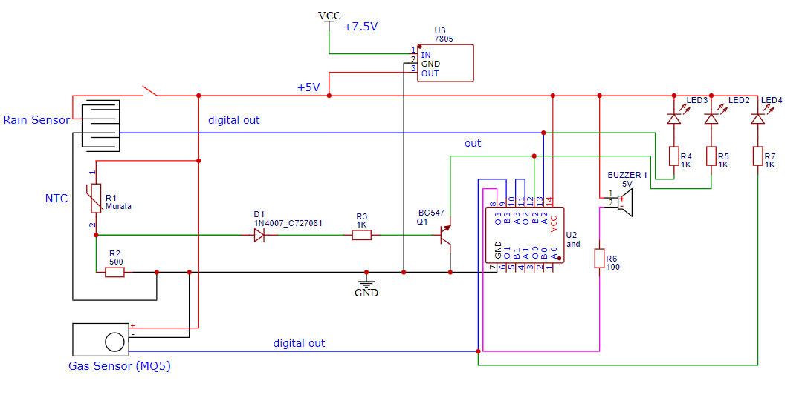

# 紀錄
## 當下情境
1. 112-1學年度(大二上)
2. 電子電路 期末專案 題目自訂
3. 負責:物理推導+電路圖設計
## 題目 : 全方位居家裝置
### 專案功能與SDGs
```
當下雨時，集雨筒達到一定高度，蜂鳴器會響起，LED開始閃爍，提醒用戶將衣物收進家裡。
火災感測器接上後，放置處若溫度過高，疑似有火源產生，蜂鳴器會響起，LED開始閃爍，直到溫度下降為止。
易燃氣體感測器接上後，放置處若瓦斯氣體濃度過高，有爆炸之風險，蜂鳴器會響起，LED開始閃爍，直到氣體濃度下降為止。
產品適用於需要有曬衣服需求的家庭，並且加購項目有偵測高溫、易燃氣體的功能，若家庭熱水器放在陽台，且衣物也放在陽台晾乾，若是有火源、瓦斯外洩會是很嚴重的安全隱患，因為瓦斯是易燃氣體，旁邊衣物則是可燃物，所以本產品希望是能夠在平時檢測衣物淋濕之餘，也能避免使用者處於危險之中。
```
### STEAM學習內容表
#### Science
1. [流體力學-阻力](https://zh.wikipedia.org/zh-tw/%E9%98%BB%E5%8A%9B)
2. [牛頓第二運動定律](https://zh.wikipedia.org/zh-tw/%E7%89%9B%E9%A0%93%E7%AC%AC%E4%BA%8C%E9%81%8B%E5%8B%95%E5%AE%9A%E5%BE%8B)
3. [流體力學-通量](https://courses.lumenlearning.com/suny-osuniversityphysics/chapter/14-5-fluid-dynamics/)
4. [流體力學-動量定理](https://arxiv.org/ftp/arxiv/papers/1504/1504.07309.pdf)
#### Technologies
1. [NTC熱敏電阻](https://www.digikey.tw/zh/blog/basics-of-ntc-and-ptc-thermistors)
#### Math
1. [分壓與分流](https://zh.wikipedia.org/zh-tw/%E9%9B%BB%E5%A3%93%E5%88%86%E9%85%8D%E5%AE%9A%E5%89%87)
### 電路圖及說明

```
左上角為雨水感測器，當集水筒內(未製作)的水滿到一定程度，雨水感測器就會通電，邏輯輸出為0，其餘時間輸出為1。
左中為NTC熱敏電阻，溫度越高，電阻越低，到達一定值輸出為高電壓(>=0.7V)，其餘時間輸出為低電壓(<0.7V)，輸出高電壓時BC547會開啟進而使LED接地，7408邏輯輸入為0。
左下為天然氣/瓦斯感測器(MQ5)，當瓦斯濃度過高時，邏輯輸出為0，其餘時間輸出為1。

將三者的輸出進行AND，若三者皆無觸發警報，則蜂鳴器與LED兩端近乎為5V，電壓差接近0，警報系統不運作，若其一者(以上)觸發警報，則蜂鳴器與LED電路接地，發出警告。

(邏輯輸出為0是相對於IC而言，在5V狀態底下IC通常會將低於0.8V以下的電壓讀成LOW)
```
### 成本
蝦皮購買，最低大約350左右。